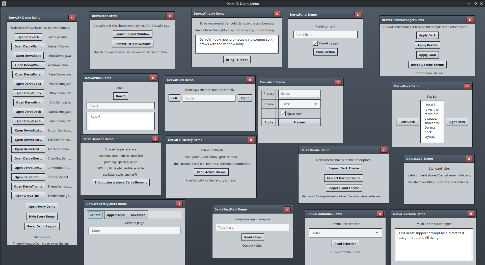

# DervaFX

[](https://github.com/PrinceOfCookies/DervaFX-Public/actions/workflows/maven-publish.yml)

Documentation lives in the [My Webiste](https://PrinceOfCookies.com/DervaFX).

Current scope:

- Small chainable wrapper base
- Basic containers and controls
- Basic grid layout support
- Basic text, toggle, and select inputs
- One simple theme manager
- One demo menu with per-component showcase windows

## Build

Requires Java 21 or newer.

```bash
mvn clean package
```

## Run

```bash
mvn javafx:run
```

The demo app is a launcher/menu that opens separate showcase windows for the
current DervaFX surfaces instead of one giant all-in-one sample.

## Demo



## Current surface

```java
DervaRoot root = DervaFX.root();

DervaWindow window = DervaFX.window("Base Window")
    .size(320, 220)
    .position(24, 24);

window.add(
    DervaFX.grid()
        .hgap(8)
        .vgap(8)
        .add(DervaFX.label("Project"), 0, 0)
        .add(DervaFX.textField().prompt("Project name"), 1, 0)
        .add(DervaFX.checkBox("Remember layout"), 0, 1, 2, 1)
        .add(DervaFX.button("Click me"), 1, 2)
);

root.add(window);
```
